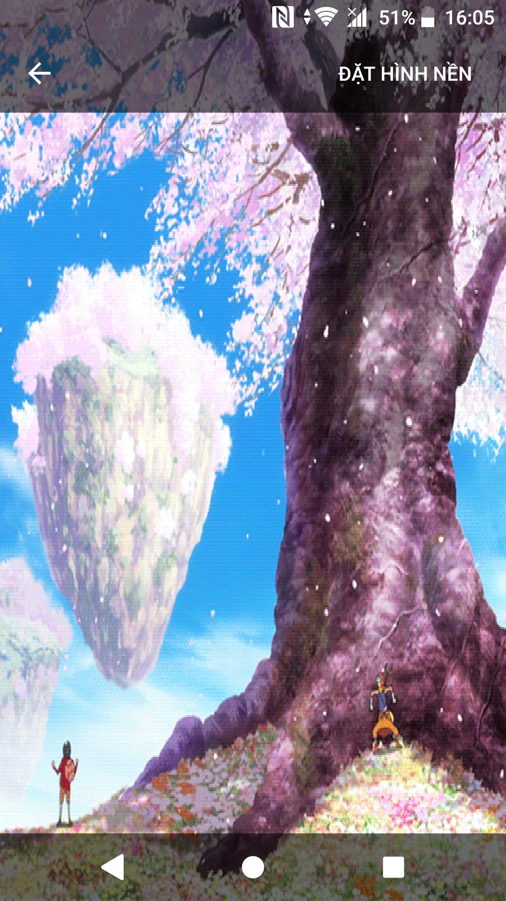
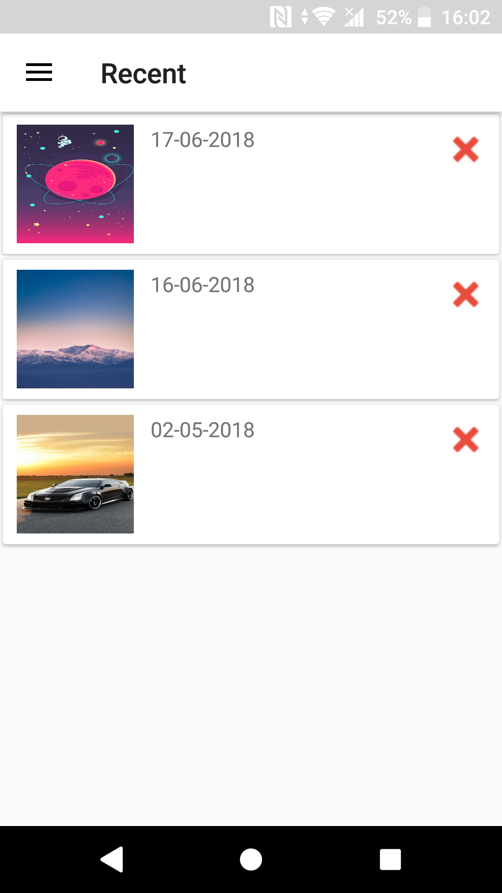

# Ứng dụng My Wallpapaer

Ứng dụng My Wallpaper cung cấp bộ ảnh nền đẹp, theo xu hướng. Người dùng có thể xem ảnh, tải ảnh, chia sẻ ảnh hoặc đặt ảnh làm nền một cách trực tiếp từ ứng dụng. Các tính năng hữu ích đặt ảnh GIF làm nền, lưu lại ảnh yêu thích, lịch sử đặt ảnh nền giúp cho người dùng trải nghiệm tốt nhất.

## Nội dung
1. [Chức năng](#chức-năng)

   1. [Xem danh sách ảnh nền](#xem-danh-sách-ảnh-nền)
   
   1. [Xem chi tiết ảnh](#xem-chi-tiết-ảnh)
   
   1. [Xem ảnh GIF](#xem-ảnh-gif)
   
   1. [Xem ảnh yêu thích và ảnh đặt làm nền](#xem-ảnh-yêu-thích-và-ảnh-đặt-làm-nền)
   
1. [Yêu cầu thiết bị](#yêu-cầu-thiết-bị)

1. [Thư viện và công nghệ](#thư-viện-và-công-nghệ)

1. [Tác giả](#tác-giả)

1. [Giấy phép](#giấy-phép)

## Chức năng
### Xem danh sách ảnh nền
   * Danh sách ảnh mới, theo xu hướng, phổ biến 
  
   * Danh sách chủ đề
  
   * Danh sách ảnh theo chủ đề
   
   

     
   

    
### Xem chi tiết ảnh
   * Chi tiết hình ảnh 
  
   * Chia sẻ hình ảnh
   
   

    
   

  
### Xem ảnh GIF
   * Xem ảnh GIF
  
   * Đặt ảnh GIF làm nền
   
   

    
   

   
### Xem ảnh yêu thích và ảnh đặt làm nền
   * Xem ảnh yêu thích
  
   * Xem ảnh đặt làm nền
   
   

    
   

   
## Yêu cầu thiết bị
-Android studio : 3.0.1

-Gradle : 4.1

-Min sdk : 19

-Target sdk : 26

-Language : Java

## Thư viện và công nghệ
* Firebase - https://firebase.google.com/

* Room database - https://developer.android.com/topic/libraries/architecture/room

* Facebook sdk - https://developers.facebook.com/docs/android/componentsdks

* Picasso - http://square.github.io/picasso/

* Spots Dialog - https://github.com/d-max/spots-dialog

* Kenburnsview - https://github.com/flavioarfaria/KenBurnsView

* RxJava - https://github.com/ReactiveX/RxJava

* Floating Action Button - https://github.com/Clans/FloatingActionButton

* Android Support Library - http://developer.android.com/tools/support-library/index.html

## Tác giả
Lê Trọng Tín - 15520893@gm.uit.edu.vn

Huỳnh Việt Tiến - 15520877@gm.uit.edu.vn

## Giấy phép

    Copyright 2014

    Licensed under the Apache License, Version 2.0 (the "License");
    you may not use this file except in compliance with the License.
    You may obtain a copy of the License at

       http://www.apache.org/licenses/LICENSE-2.0

    Unless required by applicable law or agreed to in writing, software
    distributed under the License is distributed on an "AS IS" BASIS,
    WITHOUT WARRANTIES OR CONDITIONS OF ANY KIND, either express or implied.
    See the License for the specific language governing permissions and
    limitations under the License.
